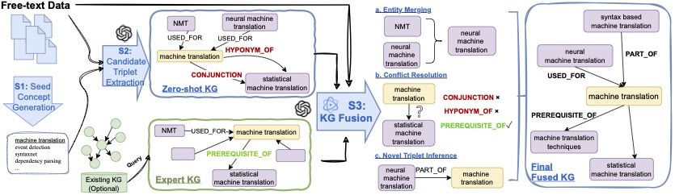

## Graphusion: Leveraging Large Language Models for Scientific Knowledge Graph Fusion and Construction in NLP Education

This is the GitHub repo for the paper submission. 

`TutorQA`: TutorQA dataset, containing 6 tasks. 

`fusion_results`: The results in txt format from Graphusion framework.

`Graphusion`: Python script for Graphusion implementation.

`Link Prediction`: Python script for Graphusion - Link Prediction module implementation:
- `src`: Zero-shot and Ablation study code. Run with >> `python xxxx.py`. We include LLaMa, GPT code.

- `simple_baselines_src`: Simple classifier baseline source code.

- `supervised_baselines_src`: GCN-based models for supervised methods. Check the readme for more information. 

- `embedding_src`: code and embedding for applying LLaMa and GPT models.

- `RAG_src`: Source code for RAG settings.

`concept_data`: text and labeled data used in the experiments.

`data_generator`: helpful code for making and cleaning TutorQA benchmark.

 
