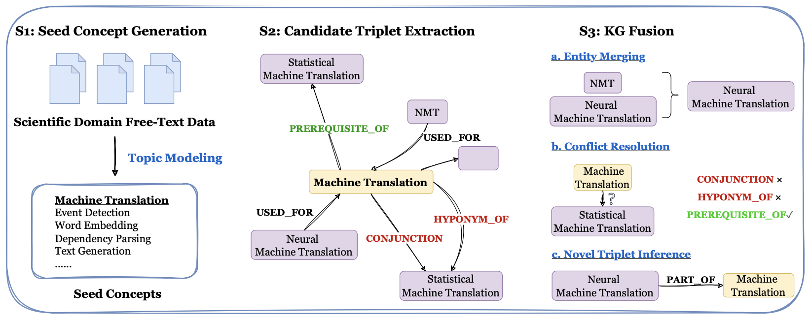

# Graphusion 

Graphusion is a pipeline that extract Knowledge Graph triples from text.




## Setup
Create a new conda environment and install the required packages:
```
conda create -n graphusion python=3.10
conda activate graphusion
pip install -r requirements.txt
```


## Usage

You need to provide the following input files:
- input_file

In addition, you have the option to provide the following input files to improve the 
results (otherwise automatically derived):
- refined_concepts_file
- relation_definitions_file
- annotated_graph

The pipeline can be run using the following command:

```
usage: main.py [-h] [--run_name RUN_NAME] [--input_file INPUT_FILE] [--relation_definitions_file RELATION_DEFINITIONS_FILE]
               [--model MODEL] [--max_resp_tok MAX_RESP_TOK] [--max_input_char MAX_INPUT_CHAR] [--prompt_step_01 PROMPT_STEP_01]
               [--annotated_graph_file ANNOTATED_GRAPH_FILE] [--prompt_fusion PROMPT_FUSION] [--verbose]
               [--refined_concepts_file REFINED_CONCEPTS_FILE]

options:
  -h, --help            show this help message and exit
  --run_name RUN_NAME   Name of the run. Is used to, e.g., determine the output directory.
  --input_file INPUT_FILE
                        Path to the input file. The input file should be a JSON file with the following structure: {'concept1':
                        [{'abstract': ['abstract1', ...], 'label: 0},...}
  --relation_definitions_file RELATION_DEFINITIONS_FILE
                        Path to the relation definitions file. The file should be a JSON file, where the keys are the relation types and
                        the values are dictionaries with the following keys: 'label', 'description'.
  --model MODEL         Name of the LLM that should be used for the KG construction.
  --max_resp_tok MAX_RESP_TOK
                        Maximum number of tokens in the response of the candidate triple extraction model.
  --max_input_char MAX_INPUT_CHAR
                        Maximum number of characters in the input of the candidate triple extraction model.
  --prompt_step_01 PROMPT_STEP_01
                        Path to the prompt template for step 1.
  --annotated_graph_file ANNOTATED_GRAPH_FILE
                        Path to the annotated graph.
  --prompt_fusion PROMPT_FUSION
                        Path to the prompt template for fusion.
  --verbose             Print additional information to the console.
  --refined_concepts_file REFINED_CONCEPTS_FILE
                        Path to a file with refined concepts of the graph. The file should be a tsv file, each row should look like:
                        "concept id | concept name"

```


## Example 
To run the pipeline on a very small sample dataset, simply call: `python main.py`

